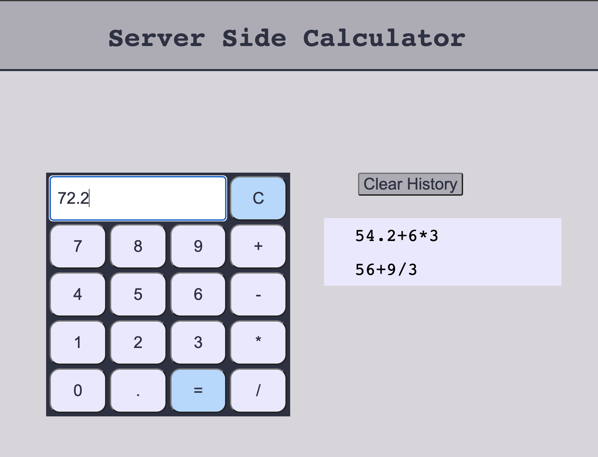

# Server Side Calculator

## Description

_Duration: Weekend Coding Challenge_

This project is a server-side calculator. The calculator takes user input (numbers, a decimal point, and mathematical operations) and submits this information to the server when the user hits the equals button through a POST route.

Validation takes place on both the client-side and the server-side (to be safe). Validation includes whether the symbols submitted are acceptable mathematical entries, whether mathematical operators always have a number between them, and whether these operators are at the correct positions.

The calculation is performed on the server. Several operators can be sent in a formula, e.g., 1+2/3-5\*4.3 would be a valid input. The server ensures that the mathematical operations are performed in the correct order: multiplication and division first, followed by addition and subtraction. (The calculator does not take parentheses as inputs.) The server then stores this result, and adds the formula that was submitted to an array. This allows the front-end interface to retrieve both the result of the latest calculation, but also the history of previous formulae through a GET request. The user can clear this history on the server by hitting a "Clear History" button—which sends a DELETE request to the server. The user can also click on these previous formulae to rerun the calculation.

The calculator behaves similar to a physical calculator. There is one screen which displays the current formula and eventually the result. The user can perform further operations on this result by selecting a mathematical operator, or choose to perform a new calculation by hitting a number or the decimal point.

To see the calculator in action, visit: [https://protected-bastion-65313.herokuapp.com/](https://protected-bastion-65313.herokuapp.com/).

## Screen Shot

## Prerequisites

The server runs on Node with Express. The front end makes use of jQuery.

- [Node.js](https://nodejs.org/en/)
- [Express](https://expressjs.com/)
- [jQuery](https://jquery.com/)

## Installation

1. After cloning this repository, run `npm install` to install dependencies in this project.
2. Run `npm start` to start the server, which will run on port 5000.
3. Open up `localhost:5000` in your browser to use the calculator.

## Usage

1. Enter a valid number in the calculator by selecting the calculator buttons. A decimal point is acceptable as a first number (it will turn into "0.").
2. Select a mathematical operations (addition, subtraction, multiplication, or division) by selecting the desired button.
3. Multiple operations can be performed in a single formula (e.g., 1.2+5.4\*3/9).
4. When ready to submit the formula, select the equals than button (=).
5. The result will be displayed on the screen.
6. Continue working with this result by selecting a mathematical operator OR start a new formula by selecting a number.
7. Selecting "C" on the calculator will reset the current formula.
8. A history of previous formulae is listed for the sake of convenience. Clicking on one of these previous formulae will rerun that calculation.
9. The history of previous formulae can be cleared by clicking on the "Clear History" button.

## Built With

1. Node.js
2. Express
3. jQuery
4. HTML
5. CSS

## Acknowledgement

Thanks to [Prime Digital Academy](www.primeacademy.io) who equipped and helped me to make this application a reality.
